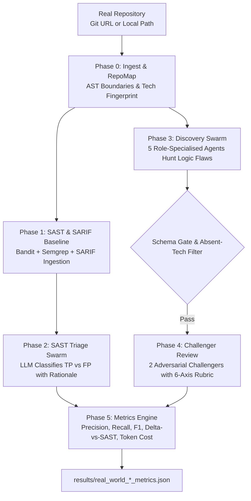

# Autonomous Multi-Agent Swarm Security Audit Harness

[](#-experiment-cycles-progression)
[](#1-evaluator-decomposition-6-axis-rubric)
[](#-real-world-repository-scanner-run_real_worldpy)
[](#-multi-provider-inference-agentsllm_clientpy)

An empirical research and production audit harness designed to rigorously evaluate whether **collaborative, specialised LLM agent swarms with adversarial peer-review** outperform generalist single agents when auditing source code for security vulnerabilities.

Tested against both **blind vulnerable benchmarks** (Cycles 11–22) with planted ground-truth flaws, **hardened clean targets**, and **arbitrary real-world repositories** via AST-based ingestion and SAST/SARIF triage.

---

## 🏛️ Pipeline Architecture

The harness supports two operational modes:

### 1. Controlled Research Sandbox (`run_cycle11.py`)
```mermaid
flowchart TD
    Target[Target Source Code\nsandbox_target/target_app_cycle13.py] --> Phase0[Phase 0: Static Pre-Filter\nDeterministic AST / Regex Baseline]
    Target --> Phase1[Phase 1: Grounded Discovery Swarm\n5 Serial Specialised Agents (llama3.2:latest)]
    
    Phase0 --> PreConfirmed[(Pre-Confirmed GT Flaws\nFull Validity)]
    
    Phase1 --> SchemaGate{Schema Gate Validator\nEvidence Chain + Anti-Hallucination}
    
    SchemaGate -->|Failed Validation| SchemaRejects[(Schema Rejects Telemetry\n& Rescue Analysis)]
    SchemaGate -->|Passed Validation| Blackboard[(Admitted LLM Findings)]
    
    Blackboard --> Phase2[Phase 2: Adversarial Peer Review\n2 Independent Challengers (qwen2.5-coder:7b)]
    
    Phase2 --> Phase3[Phase 3: Decomposed Consensus\n6-Axis Evaluation + Decoupled Severity]
    
    PreConfirmed --> Aggregator[Phase 4: Synthesis & Metrics]
    Phase3 --> Aggregator
    
    Aggregator --> OutputJSON[results/cycle*_*.json]
    Aggregator --> OutputReport[Comprehensive Audit Reports (.md)]
```

### 2. Real-World Repository Pipeline (`run_real_world.py`)


---

## 🔬 Experiment Cycles Progression

The research harness contains 12 validated empirical cycles iterating on swarm architectures, prompts, and evaluation rubrics:

| Cycle | Name | Target | Key Innovation / Focus | Run Command |
|---|---|---|---|---|
| **22** | **Evaluator Replication** | `target_app_cycle13.py` | Strict architecture & parameter freeze of Cycle 21 to validate reproducibility of 6-axis evaluator against LLM seed variance. | `python -u run_cycle11.py --cycle 22 --model llama3.2 --challenger-model qwen2.5-coder:7b --workers 5` |
| **21** | **Schema-Gate Audit** | `target_app_cycle13.py` | Auditing schema suppression vs. precision; secondary "schema rescue" analysis for repairable findings. | `python -u run_cycle11.py --cycle 21 --model llama3.2 --challenger-model qwen2.5-coder:7b --workers 5` |
| **20** | **Reproducibility Validation** | `target_app_cycle13.py` | Parameter-frozen verification of Cycle 19 6-axis evaluator decomposition stability. | `python -u run_cycle11.py --cycle 20 --model llama3.2 --challenger-model qwen2.5-coder:7b --workers 5` |
| **19** | **Evaluator Decomposition** | `target_app_cycle13.py` | 6-axis evaluation rubric + severity decoupling. Eliminated false refutations of real underlying flaws. | `python -u run_cycle11.py --cycle 19 --model llama3.2 --challenger-model qwen2.5-coder:7b --workers 5` |
| **18** | **Challenger Model A/B** | `target_app_cycle13.py` | Cross-model adversarial review: `llama3.2` discovery + `qwen2.5-coder:7b` peer reviewers. | `python -u run_cycle11.py --cycle 18 --model llama3.2 --challenger-model qwen2.5-coder:7b --workers 5` |
| **17** | **Grounded Discovery** | `target_app_cycle13.py` | 8-step self-rejection prompt requiring direct code citations (`MECHANISM_ABSENT` filter). | `python -u run_cycle11.py --cycle 17 --model llama3.2 --workers 5` |
| **16** | **Challenger Calibration** | `target_app_cycle13.py` | Preservation of `PARTIAL` verdicts; overrejection diagnostics (`CORRECT` vs `OVERREJECTION`). | `python -u run_cycle11.py --cycle 16 --model llama3.2 --workers 5` |
| **15** | **Hard Schema Gate** | `target_app_cycle13.py` | 5-field evidence chain gate + deterministic static pre-filter (100% planted GT baseline). | `python -u run_cycle11.py --cycle 15 --model llama3.2 --workers 5` |
| **14** | **Evidence-First Swarm** | `target_app_cycle13.py` | Initial structured hypothesis-evidence chains to reduce blind hallucinations. | `python -u run_cycle11.py --cycle 14 --model llama3.2 --workers 5` |
| **13A**| **Blind Vulnerable Benchmark** | `target_app_cycle13.py` | Blind testing on 6 planted vulnerabilities without hint comments. | `python -u run_cycle11.py --cycle 13a --model llama3.2 --workers 5` |
| **13B**| **Clean Hardened Target** | `target_app_cycle13b.py` | Zero-planted-flaw target to measure false-positive rejection rates. | `python -u run_cycle11.py --cycle 13b --model llama3.2 --workers 5` |
| **11** | **Hinted Benchmark** | `target_app.py` | Baseline legacy experiment with inline code comments. | `python -u run_cycle11.py --cycle 11 --model llama3.2 --workers 5` |

---

## 🌐 Real-World Repository Scanner (`run_real_world.py`)

In addition to the controlled benchmark sandbox, the system provides a production-oriented real-world orchestrator capable of scanning any codebase:

### Features
1. **Repository Ingestion (`agents/repo_ingester.py`):**
   - Automatically clones remote git repositories (`--depth 1`) or walks local directories.
   - Detects languages (`.py`, `.js`, `.ts`, `.go`, `.java`, etc.), frameworks, and tech stacks into a dynamic `RepoMap`.
   - Chunks code along AST boundaries (functions/classes) up to 6,000 characters and prioritises security-sensitive modules (auth, tokens, crypto, permissions).

2. **SAST Baseline & Generic SARIF Parser (`agents/sast_runner.py`, `agents/sarif_parser.py`):**
   - Runs Bandit (Python) and Semgrep (OWASP Top 10 + security-audit rulesets).
   - Ingests generic **SARIF** (Static Analysis Results Interchange Format) files from external scanners such as GitHub Code Scanning, Snyk, SonarQube, or Trivy.
   - Normalises rules, CWE identifiers, code snippets, and severities into a unified finding schema.

3. **SAST Alert Triage:**
   - Swarm evaluates each static analysis finding against the surrounding source context.
   - Classifies findings into `TRUE_POSITIVE` or `FALSE_POSITIVE` with detailed technical rationales.

4. **Deep Logic Flaw Discovery:**
   - Swarm discovers emergent flaws outside static analysis capabilities (business logic bypasses, broken authorization flows, multi-component token leakages).
   - Uses dynamic absent-technology filters so agents only report flaws relevant to the repository's detected stack.

5. **Benchmarking Metrics Engine (`agents/metrics_engine.py`):**
   - Measures `delta_vs_sast` (novel logic flaws caught exclusively by the swarm).
   - Calculates Precision, Recall, F1, and False Negative Rate when ground truth CVEs are provided.
   - Estimates token consumption and equivalent cloud API costs.

---

## ⚡ Multi-Provider Inference (`agents/llm_client.py`)

The unified `LLMClient` supports both local privacy-first Ollama instances and high-throughput cloud inference:

- **Local Ollama:** Default target (`http://127.0.0.1:11434`) using models like `llama3.2:latest`, `qwen2.5-coder:7b`, etc.
- **Groq Cloud API:** Prefix model names with `groq/` (e.g. `groq/llama-3.3-70b-versatile`, `groq/llama-3.1-8b-instant`). Requires the `GROQ_API_KEY` environment variable.

---

## 🧩 Key Architectural Innovations

### 1. Evaluator Decomposition (6-Axis Rubric)
In earlier cycles (13–15), adversarial challengers judged findings with a binary `VALID` / `INVALID` decision. If an agent accurately spotted a real vulnerability but misstated the exploit path or exaggerated the consequence, challengers responded `INVALID`, causing catastrophic **overrejections** (discarding true vulnerabilities).

Cycle 19 introduced a **6-axis evaluation rubric**:
1. **Factual Validity (`VALID` / `PARTIAL` / `INVALID`):** Does the described code construct exist in the source?
2. **Attack Path (`SUPPORTED` / `PARTIAL` / `UNSUPPORTED`):** Is there a viable data/control flow from input to impact?
3. **Security Property (`SUPPORTED` / `UNSUPPORTED`):** Is an established security invariant (e.g., authorization, non-repudiation) violated?
4. **Consequence (`SUPPORTED` / `UNSUPPORTED`):** Does the claimed consequence actually follow?
5. **Severity Evaluation (`AGREE` / `DISAGREE` / `INDETERMINATE`):** Independent severity reassessment.
6. **Overall Verdict (`CONFIRMED` / `PARTIALLY_SUPPORTED` / `INVALID`).**

### 2. Severity Decoupling
LLMs routinely overestimate vulnerability severity (e.g., tagging internal missing salts as `CRITICAL`). In Cycle 19+, **severity disagreements are strictly decoupled from factual validity**. A finding with an accurate factual claim is never refuted simply because the challenger believes it is `MEDIUM` rather than `CRITICAL`.

### 3. Static Pre-Filter + LLM Complementarity
* **Phase 0 Static Pre-Filter:** A deterministic scanner detects all 6 planted ground-truth issues within milliseconds (100% precision and recall on planted flaws).
* **LLM Swarm Role:** Discovers emergent logic flaws, complex path interactions, and missing defensive validations outside static regex/AST scopes.

### 4. Schema-Gate Validation & Schema Rescue
Before any LLM finding enters the shared blackboard for peer review, it must satisfy:
* **All 5 evidence fields present:** `Location`, `Path`, `Property`, `AttackerInput`, `Consequence`.
* **Substantive Path Field:** $\ge 5$ words describing concrete data flow.
* **Anti-Hallucination Filter:** Drops claims referencing absent technologies (SQL, DBMS, pickle, eval, network sockets).

In **Cycle 21**, the harness audits whether valid findings dropped by vague phrasing can be **rescued**:
* `SCHEMA_VALID`: Accepted by schema gate.
* `SCHEMA_TOO_VAGUE_BUT_REPAIRABLE`: Real underlying security issue, but path was under-described.
* `SCHEMA_INVALID_CLAIM`: References nonexistent technology.
* `SCHEMA_FALSE_POSITIVE`: Spurious claim.

---

## 👥 The 5 Research Roles & Challenger Swarm

### Discovery Swarm (`llama3.2:latest`)
Each agent analyzes the codebase under a specialized analytical lens:

| Role Key | Specialisation | Primary Focus |
|---|---|---|
| `auth_analyst` | Authentication & Session Management | Token predictability, weak KDFs, session fixation, credential storage. |
| `access_control` | RBAC & Authorization | IDOR, missing ownership checks, horizontal/vertical privilege escalation. |
| `input_validator` | Input Validation & Path Safety | Path traversal, unsanitized inputs, filesystem boundary escapes. |
| `availability_analyst` | Availability & Resource Exhaustion | Unbounded file/memory reads, resource exhaustion, CPU denial of service. |
| `secrets_scanner` | Secrets & Cryptographic Hygiene | Hardcoded keys, insecure cryptographic algorithms (MD5, SHA1), salt omission. |

### Challenger Swarm (`qwen2.5-coder:7b`)
* Two independent adversarial reviewers (`challenger-A` and `challenger-B`).
* Evaluates every LLM finding across all 6 axes independently.
* Operates under a skeptical default stance to eliminate false positives.

---

## 🎯 Target Applications & Ground Truth

### 1. Vulnerable Benchmark (`sandbox_target/target_app_cycle13.py`)
A standalone 127-line Python employee portal containing 6 planted ground-truth flaws:
* **`GT-AUTH-SECRET`**: Hardcoded `SECRET_KEY = "hr-portal-internal-2024"`.
* **`GT-AUTH-MD5`**: Unsalted MD5 password hashing in `hash_password()`.
* **`GT-AUTH-TOKEN`**: Predictable session tokens generated via `MD5(username:time:SECRET_KEY)`.
* **`GT-RBAC-IDOR-PATCH`**: `patch_profile()` updates arbitrary user profiles without authentication.
* **`GT-RBAC-ENUM`**: `get_employee_profile()` leaks full profile including `password_hash` without RBAC.
* **`GT-DATA-MASS-EXPORT`**: `export_all_records()` dumps all records and password hashes with zero access checks.

### 2. Clean Hardened Target (`sandbox_target/target_app_cycle13b.py`)
A hardened version utilizing PBKDF2-HMAC-SHA256, CSPRNG session tokens, strict RBAC, field whitelisting, and rate-limiting. Used to verify that challengers correctly reject false alarms on secure code.

---

## 📁 Repository Structure

```
cycle11_ollama_swarm/
├── run_cycle11.py               # Main experiment orchestrator & reporting engine (Cycles 11–22)
├── run_real_world.py            # Real-world repository security orchestrator (5 phases)
├── agents/
│   ├── __init__.py              # Package initializer
│   ├── llm_client.py            # Multi-provider LLM router (Ollama + Groq API)
│   ├── ollama_client.py         # Pure-stdlib HTTP client for Ollama API
│   ├── memory.py                # SQLite blackboard, challenge logger, & schema audit
│   ├── research_agents.py       # Discovery agent prompts, role specializations, challengers
│   ├── grounded_parser.py       # 8-step grounded finding parser (captures raw text)
│   ├── schema_validator.py      # Hard schema validation gate & anti-hallucination regex
│   ├── static_filter.py         # Deterministic Phase 0 AST / regex scanner (sandbox)
│   ├── sast_runner.py           # Multi-engine SAST runner (Bandit + Semgrep)
│   ├── sarif_parser.py          # Generic SARIF parser for static analysis imports
│   ├── repo_ingester.py         # Git clone, multi-language file walk, AST chunker, RepoMap
│   └── metrics_engine.py        # Real-world benchmarking (Precision, Recall, F1, Delta-SAST)
├── sandbox_target/
│   ├── target_app_cycle13.py    # Blind vulnerable benchmark (6 planted GT flaws)
│   ├── target_app_cycle13b.py   # Clean hardened target
│   └── target_app.py            # Legacy hinted target
├── results/                     # Persistent JSON results for all cycles & real-world runs
└── scratch/                     # Diagnostic scripts, comparison utilities, and audit tools
    └── generate_c22_report.py   # Cycle 22 vs Cycle 21 replication comparator
```

---

## 🚀 Running Experiments & Scans

### Prerequisites
* Python 3.10+
* [Ollama](https://ollama.com/) running locally:
  ```powershell
  ollama pull llama3.2:latest
  ollama pull qwen2.5-coder:7b
  ollama serve
  ```
* Optional SAST tools (for real-world scanning):
  ```powershell
  pip install bandit semgrep
  ```

### Common Commands

#### 1. Sandbox Research Benchmark
```powershell
# Run Cycle 22: Evaluator Replication (Current latest)
python -u run_cycle11.py --cycle 22 --model llama3.2:latest --challenger-model qwen2.5-coder:7b --workers 5

# Compare Cycle 22 replication against Cycle 21
python scratch/generate_c22_report.py

# Run Cycle 21: Schema-Gate Audit
python -u run_cycle11.py --cycle 21 --model llama3.2:latest --challenger-model qwen2.5-coder:7b --workers 5

# Run Cycle 20: Reproducibility Validation
python -u run_cycle11.py --cycle 20 --model llama3.2:latest --challenger-model qwen2.5-coder:7b --workers 5

# Run Cycle 19: 6-Axis Evaluator Decomposition
python -u run_cycle11.py --cycle 19 --model llama3.2:latest --challenger-model qwen2.5-coder:7b --workers 5

# Test Clean Hardened Target (Cycle 13B)
python -u run_cycle11.py --cycle 13b --model llama3.2:latest --workers 5
```

#### 2. Real-World Repository Scanning
```powershell
# Scan a real Git repository with Bandit and Semgrep
python -u run_real_world.py --repo https://github.com/org/example-repo --model llama3.2 --challenger-model qwen2.5-coder:7b --workers 5 --sast bandit semgrep

# Scan a local folder without running SAST tools
python -u run_real_world.py --repo ./path/to/local/project --model llama3.2 --no-sast

# Ingest an external SARIF report (e.g. from GitHub Code Scanning, Snyk, SonarQube)
python -u run_real_world.py --repo ./path/to/local/project --sarif-file ./results.sarif --model llama3.2

# Run cloud-accelerated inference using Groq API
$env:GROQ_API_KEY="gsk_..."
python -u run_real_world.py --repo ./path/to/local/project --model groq/llama-3.3-70b-versatile
```

---

## 📊 Evaluation & Artifact Outputs

Every experiment cycle outputs:
1. **Console Telemetry:** Real-time per-phase logging with color-coded verdicts.
2. **SQLite Database:** Scoped run DB (`cycle<N>_run_<timestamp>.db`) in temporary storage.
3. **Structured JSON:** Complete run artifact saved to `results/` containing all finding evidence chains, challenger breakdowns, schema audit entries, and duplicate metrics.
4. **Markdown Report:** Comprehensive summary reports (e.g., `cycle20_report.md`, `cycle21_schema_gate_audit_report.md`, `cycle22_replication_report.md`).
5. **Real-World Metrics:** `results/real_world_{run_id}_metrics.json` tracking Precision, Recall, F1, Delta-vs-SAST, and token efficiency.
